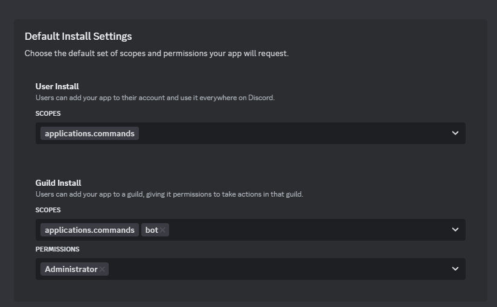

# Hootsifer
A modular Discord bot with a unique multi-channel music system, self-roles, levelling system and much more! 

- [Website](https://bot.hootsifer.com/)
- [Official invite link](https://discord.com/api/oauth2/authorize?client_id=896781020056145931&permissions=8&scope=bot%20applications.commands)
- [support server](https://discord.gg/UR3sPVEhkd)

## Installation
### Prerequisites
- Discord account
- Basic knowledge of docker  
- Docker + compose installed
- basic knowledge on how to use json (for advanced configuration)

### Making the bot account
1. Navigate to [https://discord.com/developers/applications](https://discord.com/developers/applications)
2. Click `New Application` at the top right and give it an appropriate name.


#### Configuring Bot Installation Process
1. Navigate to the `Installation` page.
2. Under Default install settings, add the `bot` scope in the guild install section, and add `Administrator` under permissions.


#### Configuring bot user
1. Navigate to the `Bot` page.
2. Disable the `Public bot` option if you prefer.
3. Under `Privileged Gateway Intents` enable the `Presence`, `Server member` and `message content` intents.
4. Find and press the reset token near the top of the page.
5. Keep hold of this token for now and ensure it is kept safe.

> [!CAUTION]
> Anyone with this token can access your bot's account!

### Local configuration

#### Main bot
1. Navigate to the `bot` folder.
2. Rename the file called `example.env` to `.env`.
3. Put the token from the previous section between the quotation mark after `DISCORD_TOKEN`.
4. Open Discord, right-click your profile in any DM or server, and click `Copy User ID`.
5. Paste this ID in the `OWNER_ID` field of the `.env` .
For further customization please refer to [`./bot/src/lib/loaders/loadEnvironment.ts`](https://github.com/Owl-barn/bot/blob/main/bot/src/lib/loaders/loadEnvironment%20.ts) to see all the available environment variables.

##### Owlet
> [!NOTE]
> This step is optional and only needed for very fine customization of the owlets.
1. Navigate to the `owlet` folder.
2. Make a `.env` file
3. refer to [`./owlet/src/lib/loaders/loadEnvironment.ts`](https://github.com/Owl-barn/bot/blob/main/owlet/src/lib/loaders/loadEnvironment%20.ts) to see all the available environment variables.


### Starting the bot
1. Open a terminal in the root folder of the project (Where this file is located).
2. Run `docker compose up -d`

## Additional configuration
The bot has more advanced features you can customize using JSON files, The functionality of these will be explained in this chapter.
### Owlet bot accounts
Create additional music bot nodes for multi-channel streaming.
> [!NOTE]
> Hootsifer will always use its own bot account for music, if you do not want to have multiple owlets you can skip this chapter.
1. Navigate to the `bot` folder.
2. Create a folder called `config` if it does not yet exist.
3. Create a file named `owlets.json` in the `config` folder.
4. Paste the json showed below into this file.
5. Populate the fields with additional bot account credentials. (do **NOT** put the main bot credentials in here)
6. Add additional entries as you please.
7. Open the `docker-compose.yml` file in the root of the project.
8. Set the `replicas` field to the amount of bot account's you added to `owlets.json` + 1.

`bot/config/owlets.json`

```json
[
    {
        "id": "",
        "token": ""
    }
]
```

### Private room names
Add customized room/channel names to the private room system.

1. Navigate to the `bot` folder.
2. Create a folder called `config` if it does not yet exist.
3. Create a file named `roomNames.json` in the `config` folder.
4. Paste the json showed below into this file.
5. Add the adjectives and nouns you want to include in their respective arrays.

> [!WARNING]
> It is not recommended to use explicit language and sensitive words for these. This may cause discord to delist your server from discovery.


`bot/config/roomNames.json`

```json
{
    "adjectives": ["", ""],
    "nouns": ["", ""]
}
```


## FAQ
 **Is there an official bot?**
> yes, you can invite it [here](https://discord.com/api/oauth2/authorize?client_id=896781020056145931&permissions=8&scope=bot%20applications.commands)

**I've more questions!**
> You can reach us in the [support server](https://discord.gg/UR3sPVEhkd)
